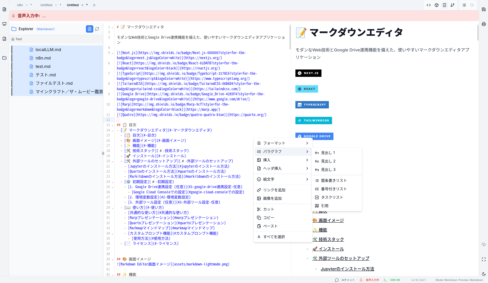

<div align="center">

# 📝 マークダウンエディタ

モダンなWeb技術とGoogle Drive連携機能を備えた、使いやすいマークダウンエディタアプリケーション

[](https://nextjs.org/)
[](https://reactjs.org/)
[](https://www.typescriptlang.org/)
[](https://tailwindcss.com/)
[](https://www.google.com/drive/)

</div>

## 📋 目次
- [📝 マークダウンエディタ](#-マークダウンエディタ)
  - [📋 目次](#-目次)
  - [🎨 画面イメージ](#-画面イメージ)
  - [✨ 機能](#-機能)
  - [🛠️ 技術スタック](#️-技術スタック)
  - [⚙️ Google Drive連携のための設定](#️-google-drive連携のための設定)
    - [1. Google Cloud Consoleでの設定](#1-google-cloud-consoleでの設定)
    - [2. 環境変数の設定](#2-環境変数の設定)
  - [🚀 インストール](#-インストール)
  - [📖 使い方](#-使い方)
  - [👨‍💻 開発](#-開発)
  - [📄 ライセンス](#-ライセンス)


## 🎨 画面イメージ


## ✨ 機能

- **リアルタイムマークダウンプレビュー:** 入力と同時にプレビューが更新されます。
- **シンタックスハイライト:** コードブロックを読みやすく表示します。
- **多様な表示モード:** エディタのみ、プレビューのみ、分割（左右）、AIチャット付き（3ペイン）など、好みに合わせて表示を切り替えられます。
- **ペイン幅調整:** 分割表示やGoogle Drive連携表示時に、各ペインの幅をドラッグで自由に調整できます。
- **ダークモード/ライトモード:** 好みに合わせてテーマを切り替えられます。
- **Vimキーバインディング:** Vimライクな操作が可能です（オン/オフ切り替え可）。
- **マークダウン書式ツールバー:** 見出し、太字、リストなどをボタン一つで挿入できます。
- **絵文字ピッカー:** 絵文字を簡単に検索・挿入できます。
- **Mermaid ダイアグラムサポート:** ` ```mermaid ` でMermaid記法による図表を作成・表示できます。
- **Google Drive連携:**
    - Googleアカウントで認証します。
    - Google Drive内のMarkdownファイル（`.md`）を一覧表示・検索できます。
    - Google Driveからファイルを開き、エディタに読み込めます。
    - エディタの内容をGoogle Driveに保存できます。
        - 新規保存時は、Markdownの最初の見出し行から自動でファイル名を生成します（例: `# My Document` → `MyDocument.md`）。
        - 既存ファイルを開いている場合は、そのファイルに上書き保存します。
    - 連携機能のオン/オフを切り替えられます。
- **ローカルファイル保存:** Google Drive連携が無効な場合、ファイルをローカルにダウンロードできます。
- **印刷機能:** プレビュー内容を印刷またはPDFとして保存できます。
- **AIチャット機能 (オプション):** エディタの内容についてAIと対話できます（別途API設定が必要）。

## 🛠️ 技術スタック

- [Next.js](https://nextjs.org/) - Reactフレームワーク (App Router)
- [React](https://reactjs.org/) - UIライブラリ
- [TypeScript](https://www.typescriptlang.org/) - 型安全な言語
- [TailwindCSS](https://tailwindcss.com/) - ユーティリティファーストCSS
- [shadcn/ui](https://ui.shadcn.com/) - 再利用可能なUIコンポーネント (Radix UI + Tailwind CSS)
- [CodeMirror](https://codemirror.net/) - 高機能テキストエディタコンポーネント
- [React Markdown](https://github.com/remarkjs/react-markdown) - マークダウンレンダラー
- [Remark GFM](https://github.com/remarkjs/remark-gfm) - GitHub Flavored Markdownサポート
- [Lucide React](https://lucide.dev/) - アイコンライブラリ
- [@react-oauth/google](https://github.com/MomenSherif/react-oauth) - Google OAuth認証ライブラリ
- [googleapis](https://github.com/googleapis/google-api-nodejs-client) - Google APIクライアントライブラリ (サーバーサイドで使用)
- [Mermaid](https://mermaid.js.org/) - ダイアグラム生成ライブラリ
- [Vercel AI SDK](https://sdk.vercel.ai/) - AIチャット機能 (オプション)

## ⚙️ Google Drive連携のための設定

Google Drive連携機能を利用するには、以下の設定が必要です。

### 1. Google Cloud Consoleでの設定

(Google Cloud Platformにアカウントがない場合は作成してください)

1.  **Google Cloud Consoleにアクセス:** [https://console.cloud.google.com/](https://console.cloud.google.com/)
2.  **新規プロジェクトを作成** (または既存のプロジェクトを選択)。
3.  **APIとサービス > ライブラリ に移動。**
4.  **「Google Drive API」を検索し、有効にする。**
5.  **APIとサービス > OAuth 同意画面 に移動。**
    *   **User Type:** 組織外のユーザーも利用する場合は「**外部**」、組織内のみの場合は「**内部**」を選択します。(テスト中は「外部」でOK)
    *   **アプリ名:** アプリケーション名（例: `MarkdownEditor`）を入力。
    *   **ユーザーサポートメール:** 自分のメールアドレスを選択。
    *   **デベロッパーの連絡先情報:** 自分のメールアドレスを入力。
    *   **「保存して次へ」をクリック。**
    *   **スコープ:** 「**スコープを追加または削除**」をクリック。
        *   フィルタで「**Google Drive API**」を検索。
        *   `.../auth/drive.file` のスコープ（特定のファイルへのアクセス）にチェックを入れ、「**更新**」をクリック。
        *   **「保存して次へ」をクリック。**
    *   **テストユーザー:**
        *   「**+ ADD USERS**」をクリック。
        *   このアプリケーションでGoogleログインを使用したい**自分のGoogleアカウントのメールアドレス**を入力します。(複数追加可能)
        *   **「追加」をクリックし、「保存して次へ」をクリック。**
    *   内容を確認し、「**ダッシュボードに戻る**」をクリック。
6.  **APIとサービス > 認証情報 に移動。**
    *   「**+ 認証情報を作成**」をクリックし、「**OAuth クライアント ID**」を選択。
    *   **アプリケーションの種類:** 「**ウェブ アプリケーション**」を選択。
    *   **名前:** 任意の名前（例: `MarkdownEditor Web Client`）を入力。
    *   **承認済みの JavaScript 生成元:**
        *   「**+ URI を追加**」をクリック。
        *   ローカル開発環境で実行するURLを入力します。通常は `http://localhost:3000` です。（異なるポートを使用している場合は、そのポート番号に合わせてください。例: `http://localhost:3001`）
    *   **承認済みのリダイレクト URI:** (今回は使用しませんが、将来的に必要になる場合があります)
    *   「**作成**」をクリック。
7.  **クライアントIDの確認:** 作成されたクライアントIDが表示されます。これを次のステップで使用します。
    *   **あなたのクライアント ID:** この値をコピーします。

### 2. 環境変数の設定

プロジェクトのルートディレクトリにある `.env.local` ファイル（なければ作成）に、Google Cloud Consoleで取得したクライアントIDを設定します。

```env:.env.local
# Google API Keys
NEXT_PUBLIC_GOOGLE_CLIENT_ID="your_google_client_id"
NEXT_PUBLIC_GOOGLE_CLIENT_SECRET="your_google_client_secret"
NEXT_PUBLIC_GOOGLE_API_KEY="your_google_api_key"
NEXT_PUBLIC_REDIRECT_URI="http://localhost:3000"

GROK_API_KEY="YOUR_GROK_API_KEY" 
```

**重要:** `.env.local` ファイルを変更した後は、Next.jsの開発サーバーを**再起動**する必要があります。

## 🚀 インストール

```bash
# リポジトリをクローン
git https://github.com/Tomatio13/v0markdown.git
cd markdown-editor

# 依存関係をインストール (npm, yarn, pnpm いずれかを使用)
npm install
# or
yarn install
# or
pnpm install
```

## 📖 使い方

1.  **開発サーバーを起動:**
    ```bash
    npm run dev
    ```
2.  ブラウザで `http://localhost:3000` (または指定されたポート) を開きます。
3.  **Google Drive連携:**
    *   ツールバーの「Google Drive連携」スイッチをオンにします。
    *   「Googleでログイン」ボタンが表示されるのでクリックし、Google Cloud Consoleでテストユーザーとして登録したアカウントでログインします。
    *   認証が成功すると、左側にGoogle DriveのMarkdownファイル一覧が表示されます。
    *   ファイルをクリックすると、内容がエディタに読み込まれます。
    *   エディタで内容を編集し、「Save (Drive)」ボタンをクリックするとGoogle Driveに保存されます。
4.  **エディタ:** マークダウンテキストを入力・編集します。
5.  **プレビュー:** 分割ビューまたはプレビュータブでレンダリング結果を確認します。
6.  **ツールバー:** 書式設定やモード切り替えなどを行います。
7.  **ローカル保存:** Google Drive連携をオフにすると、「Save」ボタンでファイルをローカルにダウンロードできます。

## 👨‍💻 開発

```bash
# 開発サーバーを起動
npm run dev

# 本番用ビルドを作成
npm run build

# 本番環境としてアプリを起動
npm start
```

## 📄 ライセンス

[MIT](https://choosealicense.com/licenses/mit/) 